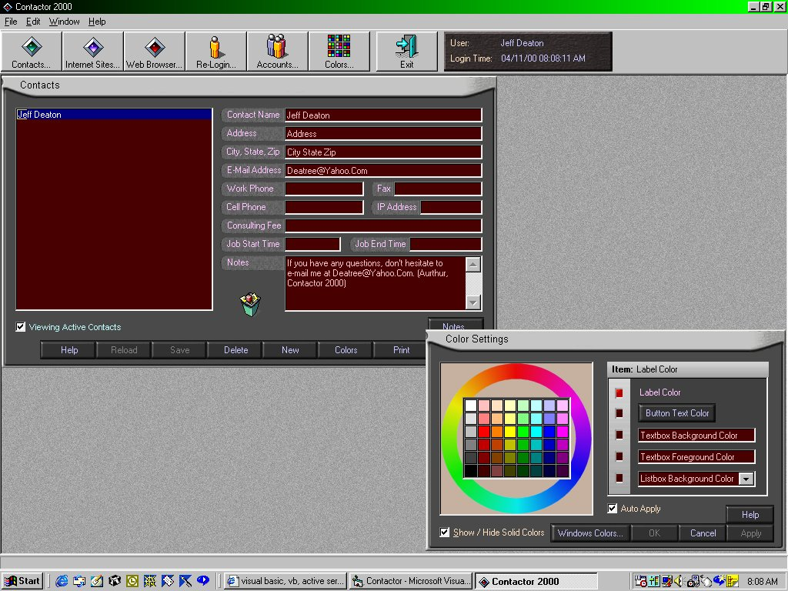



## A\+\+ Contactor 2000 \(Without Speech\-See ScreenShot\)

### Description

Record and Play Back your own Voice Messages using the MCI Control, Moving Borderless Forms, Read and Write to INI Files, Custom Colors Screen, Custom Web Browser, Custom Forms, Treeview Control with Images, Keeping forms always on top, Accessing Access 2000 databases with a password in code and more. Make a sub-directory called C:\CODE\CONTACTOR and then unzip to that location. Load the program up in VB and go from there. The Login name is "Guest" and the Password is also "Guest". If you have any questions, email me at DEATREE@YAHOO.COM and I will try to answer them.
 
### More Info
 
1) Make a sub-directory called C:\CODE\CONTACTOR

2) Unzip the code to that location!

3) Load in VB6 and run.

4) The Login Name is "Guest" and the PW is "Guest"

5) The database password can be found in the OpenDB routine. Please don't e-mail me about the DB password, it's in the code, just look for it. :)

             |
---                |---
**Submitted On**   |2000-04-13 10:17:42
**By**             |[Jeff Deaton \(Aurthor\)](https://github.com/Planet-Source-Code/PSCIndex/blob/master/ByAuthor/jeff-deaton-aurthor.md)
**Level**          |Intermediate
**User Rating**    |4.6 (83 globes from 18 users)
**Compatibility**  |VB 6\.0
**Category**       |[Complete Applications](https://github.com/Planet-Source-Code/PSCIndex/blob/master/ByCategory/complete-applications__1-27.md)
**World**          |[Visual Basic](https://github.com/Planet-Source-Code/PSCIndex/blob/master/ByWorld/visual-basic.md)
**Archive File**   |[CODE\_UPLOAD47624132000\.zip](https://github.com/Planet-Source-Code/jeff-deaton-aurthor-a-contactor-2000-without-speech-see-screenshot__1-7172/archive/master.zip)

